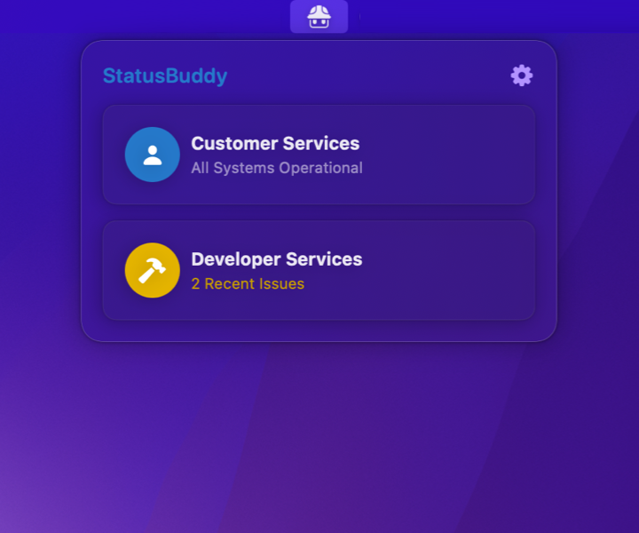

# StatusBuddy

Keep track of Apple's developer and consumer system statuses right in your menu bar.

StatusBuddy is a simple app that shows an icon on your Mac's menu bar. When an Apple service is having issues, the icon shows an exclamation mark, and you can click it to see what's going on.

While a service is experiencing issues, you may also click the notification icon to the right of the service's name to be notified when the service goes back to normal.

The app will show the same issues Apple reports in their official system status dashboards for developers and consumers, so it includes both developer services such as App Store Connect and TestFlight and consumer services such as Apple Music and TV+.

# Download

StatusBuddy is available for free. If you prefer, you can pay any amount you'd like in order to support its continued development on Gumroad, using the link below.

[You can always get the latest build on Gumroad](https://statusbuddy.app).

[You may also get the latest StatusBuddy beta on TestFlight](https://testflight.apple.com/join/MK6zSKdG) (requires macOS Monterey and the TestFlight app installed).

**StatusBuddy requires macOS Big Sur or later**